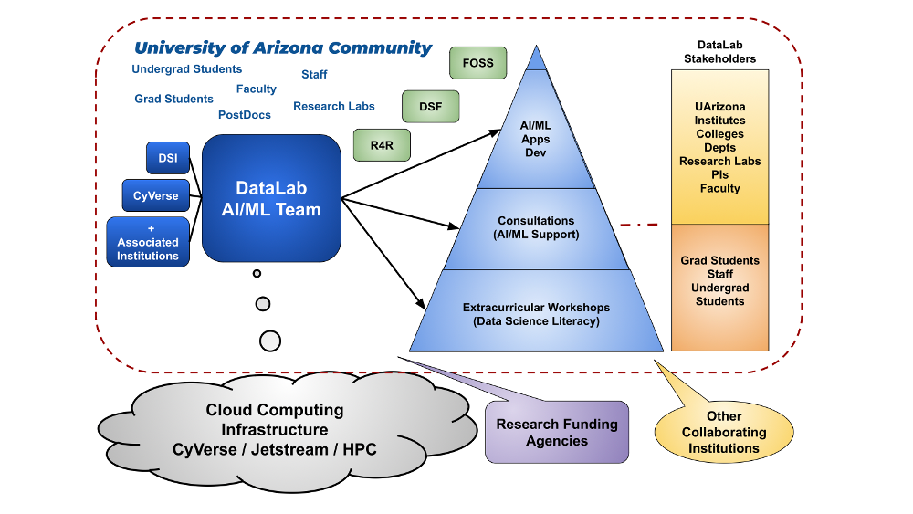

{width=840}

## Mission

The DataLab's mission is to assist the UArizona community in developing data science skills. This is achieved through various training sessions, workshops, and consultations, which aid research groups in incorporating software tools and AI-based systems. These resources enhance the cognitive skills necessary for their knowledge-discovery processes.

## Vision
The UArizona DataLab serves as a key hub for innovation. It fosters the assimilation and adoption of new AI-related technologies. This ensures the competitiveness of the UArizona academic community, which is at the forefront of knowledge discovery.

## Description

The DataLab is dedicated to providing extracurricular and non-formal training in the latest AI technologies not covered in current academic programs across various knowledge domains. Its open learning environment is perfect for studying ML/AI, and where all staff members are invited to participate.

# Partnerships

The [UArizona DataLab](https://www.datascience.arizona.edu/education/uarizona-data-lab) 
is an effective organizational structure of a collaboration between the [University of Arizona's](https://www.arizona.edu/):  
[Data Science Institute](https://www.datascience.arizona.edu/), [CyVerse](https://cyverse.org/), and
the [Institute for Computation & Data-Enabled Insight](https://datainsight.arizona.edu/)
for fostering and accelerating research in Applied AI/ML by providing access to expertise,
data, collaboration, advanced infrastructure, and training opportunities.

