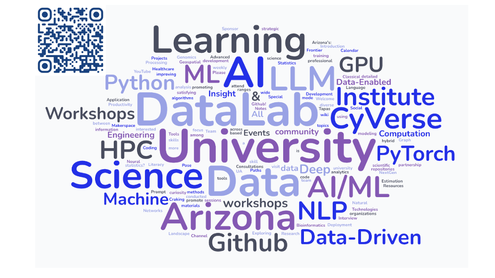

**(URL: https://ua-datalab.github.io/events/)** 

***

## Your DataLab friendly weekly remainder! :alarm_clock:

Join us for an exciting series of hands-on workshops and learning opportunities!                    

### :placard: Spring 2025 [University of Arizona DataLab Workshops](https://www.datascience.arizona.edu/education/uarizona-data-lab)

Are you interested in enhancing your proficiency with AI/ML tools, foundation models, and methodologies? The U of A DataLab team invites you to join our weekly workshops. [REGISTER for the workshop](https://datascience.arizona.edu/education/uarizona-data-lab) and join us for the workshop sessions that interest you. The workshops are free and open to anybody wanting to learn Data Science interesting topics.

Unless otherwise noted, workshop sessions are held at the **Weaver Science & Engineering Library, room 212** or via **Zoom** – register for Zoom link.

**Find all U of A DataLab workshop series and sessions on the [Data Science Institute calendar events](s://www.datascience.arizona.edu/calendar).**

***

# Spring Break Week March 10th, 2025

# :cactus: :mountain_bicyclist:  -  No DataLab Workshops - :beach_umbrella: :surfer:

***

## Events on the  week of March 17th, 2025 :mage: :four_leaf_clover:

#### :pushpin: Monday Mar. 17th.

10:00 AM - 11:00 AM. _**Leveraging National Supercomputing Resources for Research and Education**_. Stephen Deems. Director of Strategic Initiatives, Pittsburgh Supercomputing Center (PSC). University of Arizona Research Computing. (Zoom only:   [https://arizona.zoom.us/j/7386028099](https://arizona.zoom.us/j/7386028099)).

>[!NOTE]  
>Join us for a discussion about accessing computational resources around the country for
scientific research and education. Specifically, the [NAIRR Pilot](https://nairrpilot.org/) and the [NSF-funded ACCESS](https://access-ci.org/)
Allocations program will be explored showcasing how researchers and educators can take advantage  of advanced computing systems.


#### :pushpin: Tuesday Mar. 18th.

9:00 AM - 11:00 AM. [_**Data & Viz Drop-in**_](https://lib.arizona.edu/about/events/data-viz-drop). Your one-stop-shop for R, Python, Data Management and Data Visualization help. 
 :man_technologist: :woman_technologist:  In-person @ Main Library B201, [Data Studio - CATalyst Studios](https://lib.arizona.edu/study/spaces/data-studio) :coffee:  :computer: (Weekly event)


10:00 AM - 11:30:00 AM. [**Pragmatic Project Management for Everyone**](https://github.com/ua-datalab/ResearchProductivity/blob/main/README.md) (Zoom only). [[Register for Zoom link](https://uarizona.co1.qualtrics.com/survey-builder/SV_cw3FdoEFy1SSp26)]


1:00 PM - 2:00 PM. [**Classical Machine Learning**](https://github.com/ua-datalab/MLWorkshops/blob/main/README.md). _Ensemble Learning: Bagging, Boosting, & Stacking_. [[Register](https://uarizona.co1.qualtrics.com/jfe/form/SV_0CyWx6D43C7ZsmG)]

2:00 PM - 3:00 PM. [**Functional Open Science Skills for AI/ML Applications**](https://github.com/ua-datalab/FunctionalOpenSourceSkills/wiki). _End-to-end ML Workflow pt.1_. [[Register](https://uarizona.co1.qualtrics.com/jfe/form/SV_cI55gABtcr9GjfE)]

3:30 PM - 4:30 PM. [_**AI Makerspace MeetUp**_](https://github.com/ua-datalab/AI-Makerspace/blob/main/README.md). [[Register](https://uarizona.co1.qualtrics.com/jfe/form/SV_5mRIgo8t54wO3Ii)]. :man_technologist: :woman_technologist:  In-person @ Snakes & Lattes - Tucson (988 E University Blvd, Tucson, AZ). :game_die: :chess_pawn: :snake: :coffee: 


#### :pushpin: Wednesday Mar. 19th.

8:30 AM - 10:30 AM. _**Coffee &  Code**_.  :man_technologist: :woman_technologist:  In-person @ Catalyst Café - [BSRL Lobby](https://bsrl.arizona.edu/) :coffee:  :computer: (Weekly event)


1:00 PM - 2:00 PM. [**Data Science Tapas**](https://github.com/ua-datalab/DataScience-Tapas/blob/main/README.md). _Introduction to Deep Learning for Healthcare_. (Zoom only).  [[Register](https://uarizona.co1.qualtrics.com/jfe/form/SV_brM5XGZHc4AhHgO)] 


#### :pushpin: Thursday Mar. 20th.

12:00 PM - 1:00 PM. [**NLP for All**](https://github.com/ua-datalab/NLP-Speech/blob/main/README.md). _Introduction to Speech Technology_.  [[Register](https://uarizona.co1.qualtrics.com/jfe/form/SV_3pEBKSiN4ejcY86)]

1:00 PM - 2:00 PM. [**Mastering GenAI Foundation Models for Research**](https://github.com/ua-datalab/Generative-AI/blob/main/README.md). _Function calling with LLMs_ [[Register](https://uarizona.co1.qualtrics.com/jfe/form/SV_0wWiJ946ta9ExzE)]

2:00 PM - 3:00 PM. [**Bioinformatics & Genomics**](https://github.com/ua-datalab/Bioinformatics/wiki). _De-novo Detection and Annotation of Transposable Elements_. [[Register](https://uarizona.co1.qualtrics.com/jfe/form/SV_eUHXcEqBSFo44d0)]

4:00 PM - 7:00 PM. _**Hacky Hour**_.  :man_technologist: :woman_technologist: In-person @ Snakes & Lattes - Tucson (988 E University Blvd, Tucson, AZ). :game_die: :chess_pawn: :snake: :coffee: (Weekly event)  


#### :pushpin: Friday Mar. 21st.


10:00 AM - 11:00 AM. [_**CyVerse Office Hours**_](https://learning.cyverse.org/)  [[Register](https://uarizona.co1.qualtrics.com/jfe/form/SV_d0F8WzR8CjuF6Qe)] :man_technologist: :woman_technologist:  In-person @ Catalyst Café - [BSRL Lobby](https://bsrl.arizona.edu/) :coffee:  :computer:


<!--
10:00 AM - 11:00 AM. [**CyVerse Webinars**](https://cyverse.org/webinars). _Strategies for Managing Data for Team Projects. Part 2_. [[Register](https://uarizona.co1.qualtrics.com/jfe/form/SV_0v0wroSX28lhiL4)]
 (_Zoom only)_
-->


***

:calendar: _**Upcoming Events Spring 2025**_ 

* :pushpin:  Mar 22- 23. 9:00 AM - 5:00 PM [The Carpentries: Computational Skills for Researchers](https://ua-carpentries-workshops.github.io/2025-03-22-Tucson/). BIO5 Institute, Data Science Institute, University Libraries. University of Arizona :carpentry_saw:  [[Register](https://docs.google.com/forms/d/e/1FAIpQLScu0eeHgx799QUtxOfmuA45AiBqEAWKup9FxLDu3sXjIMF3Mw/viewform)]


***


**Questions / Contact:** Please join the [UA Data Science Slack channel](https://uadatascience.slack.com/#datalab-chatter):
```
#datalab-chatter
```
or the workshop presenter.

Additional learning resources:  [U of A DataLab GitHub repository](https://ua-datalab.github.io/).

Watch previous U of A DataLab workshops on our [UArizona DataLab YouTube Channel](https://www.youtube.com/@UArizonaDataLab/playlists).

_**We look forward to seeing you at the workshops. Register now!**_

_**Please feel free to share this with your friends and colleagues.**_

***


Updated 03/07/2025 (C. Lizárraga - clizarraga AT arizona.edu). [UArizona DataLab](https://ua-datalab.github.io/).


