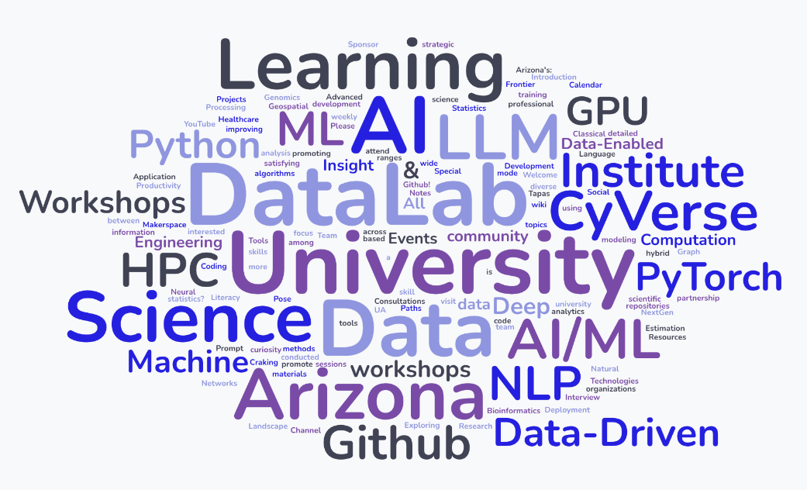

## Your DataLab friendly weekly remainder! :alarm_clock:

Join us for an exciting series of hands-on workshops and learning opportunities!                    

### :placard: Spring 2025 [University of Arizona DataLab Workshops](https://www.datascience.arizona.edu/education/uarizona-data-lab)

Are you interested in enhancing your proficiency with AI/ML tools, foundation models, and methodologies? The U of A DataLab team invites you to join our weekly workshops. [REGISTER for the workshop](https://datascience.arizona.edu/education/uarizona-data-lab) and join us for the workshop sessions that interest you. The workshops are open and free.

Unless otherwise noted, workshop sessions are held at the **Weaver Science & Engineering Library, room 212** or via **Zoom** – register for Zoom link.

**Find all U of A DataLab workshop series and sessions on the [Data Science Institute calendar events](s://www.datascience.arizona.edu/calendar).**

#### :pushpin: Tuesday Feb. 11th
<!--
11:30 AM - 1:00 PM. [**Leadership through Project Management: Team Culture Tips for Successful Research Projects**](https://github.com/ua-datalab/ResearchProductivity/blob/main/README.md) (Zoom only). [[Register for Zoom link](https://uarizona.co1.qualtrics.com/survey-builder/SV_cw3FdoEFy1SSp26)]
-->

1:00 PM - 2:00 PM. [**Classical Machine Learning**](https://github.com/ua-datalab/MLWorkshops/blob/main/README.md). _Supervised Learning:  Classification_. [[Register](https://uarizona.co1.qualtrics.com/jfe/form/SV_0CyWx6D43C7ZsmG)]

2:00 PM - 3:00 PM. [**Functional Open Science Skills for AI/ML Applications**](https://github.com/ua-datalab/FunctionalOpenSourceSkills/wiki). _Learning to Working in the Cloud: JetStream2 and Reproducibility_. [[Register](https://uarizona.co1.qualtrics.com/jfe/form/SV_cI55gABtcr9GjfE)]

3:30 PM - 4:30 PM. [_**AI Makerspace MeetUp**_](https://github.com/ua-datalab/AI-Makerspace/blob/main/README.md). [[Register](https://uarizona.co1.qualtrics.com/jfe/form/SV_5mRIgo8t54wO3Ii)]. :man_technologist: :woman_technologist: Snakes & Lattes - Tucson (988 E University Blvd, Tucson, AZ). :game_die: :chess_pawn: :snake: :coffee: 


#### :pushpin: Wednesday Feb. 12th
8:30 AM - 10:30 AM. _**Coffee &  Code**_. :coffee:  :computer: . Catalyst Café - [BSRL Lobby](https://bsrl.arizona.edu/) (Weekly event)

<!--
1:00 PM - 2:00 PM. [**Data Science Tapas**](https://github.com/ua-datalab/DataScience-Tapas/blob/main/README.md). _Introduction to Python for Data Science_. [[Register](https://uarizona.co1.qualtrics.com/jfe/form/SV_brM5XGZHc4AhHgO)] 
-->

#### :pushpin: Thursday Feb. 13th
12:00 PM - 1:00 PM. [**NLP for All**](https://github.com/ua-datalab/NLP-Speech/blob/main/README.md). _Text pre-processing for NLP_.  [[Register](https://uarizona.co1.qualtrics.com/jfe/form/SV_3pEBKSiN4ejcY86)]

1:00 PM - 2:00 PM. [**Mastering GenAI Foundation Models for Research**](https://github.com/ua-datalab/Generative-AI/blob/main/README.md). _Best practices of Prompt Engineering using UArizona AI Verde Chatbot_ [[Register](https://uarizona.co1.qualtrics.com/jfe/form/SV_0wWiJ946ta9ExzE)]

2:00 PM - 3:00 PM. [**Bioinformatics & Genomics**](https://github.com/ua-datalab/Bioinformatics/wiki). _RNA-Seq Data Analysis in R: From Raw Counts to Differential Expression Analysis_. [[Register](https://uarizona.co1.qualtrics.com/jfe/form/SV_eUHXcEqBSFo44d0)]

4:00 PM - 7:00 PM. _**Hacky Hour**_. Snakes & Lattes - Tucson (988 E University Blvd, Tucson, AZ). :game_die: :chess_pawn: :snake: :coffee: (Weekly event)  


#### :pushpin: Friday Feb 14th.
<!--
10:00 AM - 11:00 AM. [**CyVerse Office Hours**](https://learning.cyverse.org/)  [[Register](https://uarizona.co1.qualtrics.com/jfe/form/SV_d0F8WzR8CjuF6Qe)]
- [BSRL Lobby](https://bsrl.arizona.edu/)
-->

10:00 AM - 11:00 AM. [**CyVerse Webinars**](https://cyverse.org/webinars). _Strategies for Managing Data for Team Projects. Part 1_. [[Register](https://uarizona.co1.qualtrics.com/jfe/form/SV_cMggVcnCLwAWL6m)]
 (_Zoom only)_

***

:calendar: _**Upcoming Events Spring 2025**_ 


#### :pushpin:  UArizona HPC -  [**Accelerated Data Science with NVIDIA RAPIDS**](https://www.nvidia.com/content/dam/en-zz/Solutions/deep-learning/deep-learning-education/DLI-Workshop-Fundamentals-of-Accelerated-Data-Science-with-RAPIDS.pdf).   [[Register](https://docs.google.com/forms/d/e/1FAIpQLSdBFAqG9AzDnupatWYyxWmxK_PTLO5C9NNfT6BMGJejENfruQ/viewform?usp=header)]
* Thursday Feb 20th. 9:00 AM - 12:00 PM. Science & Engineering Library Room 212.
* Friday Feb 21st. 1:00 PM - 5:00 PM. Main Library Room 252.

#### :pushpin: CCT Data Science Team
* Wednesday Feb 26th. 11:00 AM - 1:00 PM. [**Managing Complicated Research Workflows In R With {targets}**](https://datascience.cct.arizona.edu/events/managing-complicated-research-workflows-r-targets).  

***

**Questions / Contact:** Please join the [UA Data Science Slack channel](https://uadatascience.slack.com/#datalab-chatter):
```
#datalab-chatter
```
or the workshop presenter.

Additional learning resources:  [U of A DataLab GitHub repository](https://ua-datalab.github.io/).

Watch previous U of A DataLab workshops on our [UArizona DataLab YouTube Channel](https://www.youtube.com/@UArizonaDataLab/playlists).

_**We look forward to seeing you at the workshops. Register soon!**_

_**Please feel free to share this with your friends and colleagues.**_

***


Updated 02/08/2025 (C. Lizárraga - clizarraga AT arizona.edu). [UArizona DataLab](https://ua-datalab.github.io/).


