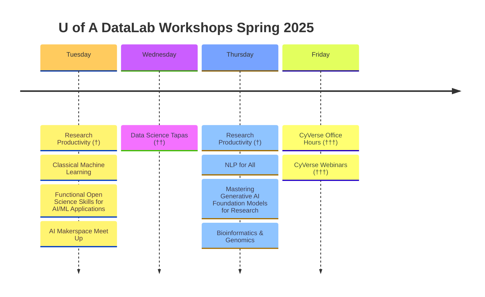

# Welcome to the University of Arizona DataLab Github!

{width=1200}

(**URL: https://ua-datalab.github.io**)

***

# Workshops

Our workshops focus on promoting Data Science Literacy among the university community. This ranges from satisfying curiosity to diverse topics in Statistics and Data Science to Machine Learning, to promote skill development in data modeling based on Machine Learning and Deep Learning algorithms across the wide science community of our University.

***
<!--
# Spring 2025 Workshops

Are you interested in improving your professional skills in data analytics tools, methods, scientific analysis and statistics?

The [University of Arizona DataLab](https://www.datascience.arizona.edu/education/uarizona-data-lab) team invites you to attend our weekly Workshops. All sessions are conducted in hybrid mode.

Please join us in-person at the **Weaver Science & Engineering Library Room 212**, or join via **Zoom:**  [**896 6708 1542**](https://arizona.zoom.us/j/89667081542)

## Notes and code repositories  

### University of Arizona DataLab Spring 2025 workshops and training materials (Jan-Mar 2025).

(†) This three-session series will be offered twice in Spring 2025. 
(††)  Happening every other Wednesday. (†††) Alternating on Fridays.
-->

***

#### Weekly Support Activities :man_technologist: :woman_technologist:
* [CyVerse Office Hours](https://learning.cyverse.org/) 
[[Register](https://uarizona.co1.qualtrics.com/jfe/form/SV_d0F8WzR8CjuF6Qe)] - [BSRL
Lobby](https://bsrl.arizona.edu/)

[**Also see UofA regular weekly Data Science support events**](https://ua-datalab.github.io/events/)
**Please visit our [Events Calendar](https://ua-datalab.github.io/events/) for weekly activities details.**

### Previous DataLab Workshops Learning Resources

* [Advanced AI for Healthcare](https://github.com/ua-datalab/ai-healthcare/tree/main). Greg Chism.
* [AI Toolkit for Professionals](https://github.com/ua-datalab/AI-for-Professionals/wiki). Carlos Lizárraga.
* [AI Makerspace Meet-Up](https://github.com/ua-datalab/AI-Makerspace/blob/main/README.md). Enrique Noriega, Carlos Lizárraga. :toolbox: :hammer_and_wrench: :robot: Meet-Ups:(Resuming Aug 26, 2025) Tuesdays 3:30 - 4:30 PM @ [Snakes & Lattes Tucson](https://www.snakesandlattes.com/tucson) (988 E University Blvd, Tucson, AZ). 
* [Bioinformatics & Genomics](https://github.com/ua-datalab/Bioinformatics/wiki). Michele Cosi, Clement Goubert, Francesca Vitali, Simona Merlini.
* [Classical Machine Learning](https://github.com/ua-datalab/MLWorkshops/blob/main/README.md). Carlos Lizárraga. 
* [Craking the Coding Interview](https://github.com/ua-datalab/cracking_the_coding_interview). Mithun Paul.
* [Data Engineering Technologies](https://github.com/ua-datalab/DataEngineering). Shashank Yadav.
* [Data Science, an Introducción](https://github.com/ua-datalab/Workshops/wiki). Carlos Lizárraga, Megh Krishnaswamy.
* [Data Science Tools and Methods in Earth Sciences](https://github.com/clizarraga-UAD7/geo-datascience2/blob/main/docs/README.md). Carlos Lizárraga.
* [Data Science Tapas](https://github.com/ua-datalab/DataScience-Tapas/blob/main/README.md). :woman_scientist: :scientist: :bar_chart:  Every other Wednesday 1:00 - 2:00 PM.
* [Deep Learning](https://github.com/ua-datalab/DLWorkshops/wiki). Mithun Paul.
* [Functional Open Science  Skills for AI/ML Applications](https://github.com/ua-datalab/FunctionalOpenSourceSkills/wiki). Michele Cosi, Carlos Lizárraga, Enrique Noriega, Leonardo Soto Hernandez.
* [Generative AI Foundation Models for Research](https://github.com/ua-datalab/Generative-AI/blob/main/README.md).  Nick Eddy, Enrique Noriega.
* [Graph Machine Learning](https://github.com/ua-datalab/GraphML). Shashank Yadav. 
* [Natural Language Processing for All](https://github.com/ua-datalab/NLP-Speech/blob/main/README.md).  Megh Krishnaswamy, Mithun Paul.  :robot: :speech_balloon:  Thursdays 12:00 - 1:00 PM.
* [Neural Networks](https://github.com/ua-datalab/NeuralNetworks/wiki). Brenda Huppenthal, Megh Krishnaswamy, Carlos Lizárraga.
* [NextGen Geospatial](https://github.com/ua-datalab/Geospatial_Workshops/wiki). Jeff Gillan.
* [Research Productivity](https://github.com/ua-datalab/ResearchProductivity/blob/main/README.md). Rudy Salcido. :black_nib: :chart_with_upwards_trend:
* [Prompt Engineering & AI Application Deployment - GPT 101](https://tyson-swetnam.github.io/intro-gpt/) ([Previous version 2023](https://ua-data7.github.io/introllms/)). Tyson Swetnam. 
* [Previous Data Science Institute Workshops](https://workshops-uad7.github.io/). Carlos Lizárraga. 

## University of Arizona HPC

* [HPC Workshops Calendar](https://hpcdocs.hpc.arizona.edu/events/calendar/)
* [HPC Workshops and Training Materials](https://hpcdocs.hpc.arizona.edu/events/workshop_materials/)
* [HPC Documentation](https://hpcdocs.hpc.arizona.edu/)

<!--
***

## Project based workshops

* [Pose Estimation using Deep Learning](https://github.com/ua-datalab/DL-pose-estimation/wiki) :rat:
-->

****

## Other learning resources

* [Data Science Learning Resources wiki](https://github.com/ua-data7/LearningResources/wiki)
* [DataLab Projects](https://github.com/clizarraga-UAD7/DataScienceLab/wiki/Data-Lab-Projects)
* [AI Tools Landscape](https://github.com/ua-datalab/Workshops/wiki/AI-Tools-Landscape)

***

## University of Arizona DataLab Social 

* [Github](https://github.com/ua-datalab)
* [Linkedin](https://www.linkedin.com/company/100483432/admin/feed/posts/)
* [Bluesky Social](https://bsky.app/profile/uarizonadatalab.bsky.social)
* [Facebook Page](https://www.facebook.com/profile.php?id=61556132138807)
* Workshop videorecordings [YouTube Channel](https://www.youtube.com/@UArizonaDataLab)
* Questions / Contact Us: UA Data Science Slack (uadatascience.slack.com) `#datalab-chatter`

***

Please visit the University of Arizona [**Data Science Institute Events Calendar**](https://www.datascience.arizona.edu/calendar) for more detailed information.

***

[University of Arizona DataLab](https://www.datascience.arizona.edu/education/uarizona-data-lab), is a strategic program between the [University of Arizona's](https://www.arizona.edu/)  [Data Science Institute](https://www.datascience.arizona.edu/), and [CyVerse](https://cyverse.org/).

| Sponsor organizations  |
| :--: | :--: |
| [{width="600"}](https://datascience.arizona.edu) | [{width="300"}](https://cyverse.org/) | 
