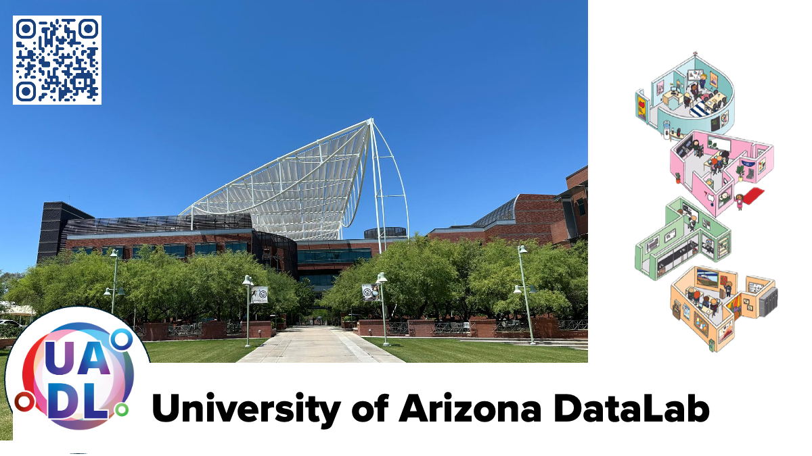

# Welcome to the University of Arizona DataLab Github!

{width=1200}

(**URL: https://ua-datalab.github.io**)

***

##  Workshops

Our workshops focus on promoting Data Science Literacy among the university community. This ranges from satisfying curiosity to diverse topics in Statistics and Data Science to Machine Learning, to promote skill development in data modeling based on Machine Learning and Deep Learning algorithms across the wide science community of our University.


***

## Fall 2025 Workshops

Are you interested in improving your professional skills in data analytics tools, methods, scientific analysis and statistics?

The [University of Arizona DataLab](https://www.datascience.arizona.edu/education/uarizona-data-lab) team invites you to attend our weekly Workshops. All sessions are conducted in hybrid mode.

<!--
Please join us in-person at the **Weaver Science & Engineering Library Room 212**, or join via **Zoom:**  [**896 6708 1542**](https://arizona.zoom.us/j/89667081542)
-->


(†) This three-session series will be offered twice in Fall 2025. 
(††) Alternating on Fridays.


***


## University of Arizona DataLab Fall 2025 workshops and training materials 


### Weekly Support Activities :material-account-multiple-check: :material-help-box-multiple:

* [CyVerse Office Hours](https://learning.cyverse.org/) 
[[Register](https://uarizona.co1.qualtrics.com/jfe/form/SV_d0F8WzR8CjuF6Qe)] - [BSRL
Lobby](https://bsrl.arizona.edu/)
* [AI Makerspace Meet-Up](https://github.com/ua-datalab/AI-Makerspace/blob/main/README.md). Enrique Noriega, Carlos Lizárraga. :material-toolbox: :material-hammer-wrench: :material-robot: Meet-Ups:(Resuming Aug 26, 2025) :material-account-multiple: Tuesdays 3:30 - 4:30 PM @ [Snakes & Lattes Tucson](https://www.snakesandlattes.com/tucson) (988 E University Blvd, Tucson, AZ). 

**:material-information-slab-circle-outline:** Please visit our [Events Calendar](https://ua-datalab.github.io/events/) for weekly activities details.

## :material-format-list-group: Fall 2025 Workshops

[**Running:** Aug 26 - Oct 30]

* [Bioinformatics & AI](https://github.com/ua-datalab/Bioinformatics/wiki). Michele Cosi. :material-dna: :material-molecule: :material-brain: 
* [Data Science Tapas](https://github.com/ua-datalab/DataScience-Tapas/blob/main/README.md). Wednesdays @ 1:00 - 2:00 PM :material-coffee: :material-data-matrix: (Online :material-cast-education:).
* [Foundational Open Science Skills](https://cyverse.org/foss). Michele Cosi. Tuesdays @ 11:00 AM  - 1:00 PM. :material-lock-open-variant: :material-cloud-lock-open-outline: :material-book-open-page-variant: :material-folder-open: (Online :material-cast-education:).
* [From Neural Networks to Transformers: The Evolution of Deep Learning](https://github.com/ua-datalab/NeuralNetworks/wiki). Enrique Noriega, Carlos Lizárraga.  :material-language-python: :material-brain: :material-robot:  Tuesdays @ 1:00 PM - 2:00 PM. 
* [Navigating the Modern AI Landscape: RAG, Tool-Use, and Agents](https://github.com/ua-datalab/Generative-AI/blob/main/README.md).  Nick Eddy, Enrique Noriega.  :material-language-python: :material-brain: :material-robot:  Thursdays @  1:00 PM - 2:00 PM.
* [Python & AI for Data Analysis](https://github.com/ua-datalab/Workshops/blob/main/README.md). Carlos Lizárraga.   :material-language-python: :material-chart-scatter-plot: :material-brain: Tuesdays @ 2:00 PM - 3:00 PM. 
* [Research Productivity](https://github.com/ua-datalab/ResearchProductivity/blob/main/README.md).
Rudy Salcido. :material-notebook: :material-chart-timeline:  (Online :material-cast-education:).  
[**Series 1:** Sep 9, Sep 30, Oct 21; **Series 2:** Nov 4 - Nov 6]. All sessions @ 10:00 AM - 11:30 AM.

### :material-format-list-group:  Previous DataLab Workshops Learning Resources

* [Advanced AI for Healthcare](https://github.com/ua-datalab/ai-healthcare/tree/main). Greg Chism.
* [AI & Data in Public Health: A Non-Coder's Toolkit!](https://github.com/ua-datalab/AI-for-Professionals/wiki). Carlos Lizárraga.
* [Classical Machine Learning](https://github.com/ua-datalab/MLWorkshops/blob/main/README.md). Carlos Lizárraga. 
* [Craking the Coding Interview](https://github.com/ua-datalab/cracking_the_coding_interview). Mithun Paul.
* [Data Engineering Technologies](https://github.com/ua-datalab/DataEngineering). Shashank Yadav.
* [Data Science Tools and Methods in Earth Sciences](https://github.com/clizarraga-UAD7/geo-datascience2/blob/main/docs/README.md). Carlos Lizárraga.
* [Deep Learning](https://github.com/ua-datalab/DLWorkshops/wiki). Mithun Paul.
* [Functional Open Science  Skills for AI/ML Applications](https://github.com/ua-datalab/FunctionalOpenSourceSkills/wiki). Michele Cosi, Carlos Lizárraga, Enrique Noriega, Leonardo Soto Hernandez.
* [Graph Machine Learning](https://github.com/ua-datalab/GraphML). Shashank Yadav. 
* [Natural Language Processing for All](https://github.com/ua-datalab/NLP-Speech/blob/main/README.md).  Megh Krishnaswamy, Mithun Paul. 
* [NextGen Geospatial](https://github.com/ua-datalab/Geospatial_Workshops/wiki). Jeff Gillan.
* [Prompt Engineering & AI Application Deployment - GPT 101](https://tyson-swetnam.github.io/intro-gpt/) ([Previous version 2023](https://ua-data7.github.io/introllms/)). Tyson Swetnam. 
* [Previous Data Science Institute Workshops](https://workshops-uad7.github.io/). Carlos Lizárraga. 

***

### :material-format-list-group: University of Arizona HPC

* [HPC Workshops Calendar](https://hpcdocs.hpc.arizona.edu/events/calendar/)
* [HPC Workshops and Training Materials](https://hpcdocs.hpc.arizona.edu/events/workshop_materials/)
* [HPC Documentation](https://hpcdocs.hpc.arizona.edu/)


***

### :material-format-list-group: Other learning resources

* [Data Science Learning Resources wiki](https://github.com/ua-data7/LearningResources/wiki)
* [DataLab Projects](https://github.com/clizarraga-UAD7/DataScienceLab/wiki/Data-Lab-Projects)
* [AI Tools Landscape](https://github.com/ua-datalab/Workshops/wiki/AI-Tools-Landscape)

***

### :material-web: University of Arizona DataLab Social 

* [Github](https://github.com/ua-datalab)
* [Linkedin](https://www.linkedin.com/company/100483432/admin/feed/posts/)
* [Bluesky Social](https://bsky.app/profile/uarizonadatalab.bsky.social)
* [Facebook Page](https://www.facebook.com/profile.php?id=61556132138807)
* Workshop videorecordings [YouTube Channel](https://www.youtube.com/@UArizonaDataLab)


**Questions / Contact:** Please join the [UA Data Science Slack channel](https://uadatascience.slack.com/#datalab-chatter):
```
#datalab-chatter
```


***

:material-information-slab-circle-outline: Please visit the University of Arizona [**Data Science Institute Events Calendar**](https://www.datascience.arizona.edu/calendar) for more detailed information.


***

[University of Arizona DataLab](https://www.datascience.arizona.edu/education/uarizona-data-lab), is a strategic program between the [University of Arizona's](https://www.arizona.edu/)  [Data Science Institute](https://www.datascience.arizona.edu/), and [CyVerse](https://cyverse.org/).


<hr>

<p style="text-align: center">

<table style="width: 100%; table-layout: fixed;">
  <tr>
      <td style="width: 500px">
      <a href="https://datascience.arizona.edu/"></a></td>
       <td style="width: 500px"><a href="https://cyverse.org/"></a></td>
   </tr>
</table>

</p>

