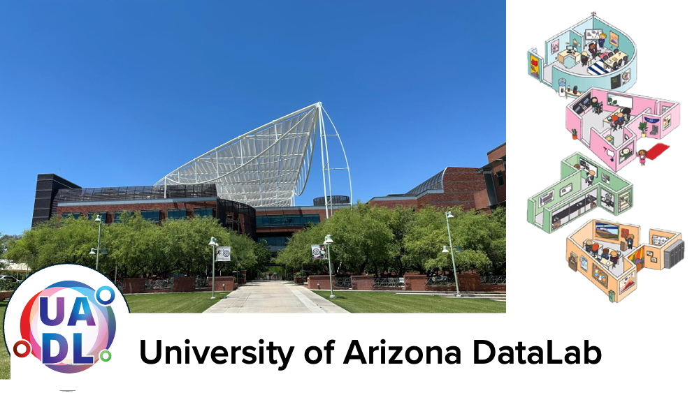

(**URL: https://ua-datalab.github.io**)

# Welcome to the University of Arizona DataLab Github!

{width=1200}

***

# Workshops

Our workshops focus on promoting Data Science Literacy among the university community. This ranges from satisfying curiosity to diverse topics in Statistics and Data Science to Machine Learning, to promote skill development in data modeling based on Machine Learning and Deep Learning algorithms across the wide science community of our University.

***

# 2025 Workshops

Are you interested in improving your professional skills in data analytics tools, methods, scientific analysis and statistics?

The [University of Arizona DataLab](https://www.datascience.arizona.edu/education/uarizona-data-lab) team invites you to attend our weekly Workshops. All sessions are conducted in hybrid mode.

Please join us in-person at the **Weaver Science & Engineering Library Room 212**, or join via **Zoom:**  [**896 6708 1542**](https://arizona.zoom.us/j/89667081542)

## Notes and code repositories  

### University of Arizona DataLab Spring 2025 workshops and training materials (Jan-Mar 2025).

***

* [AI Makerspace](https://github.com/ua-datalab/AI-Makerspace). Enrique Noriega, Carlos Lizárraga. :toolbox: :hammer_and_wrench: :robot: In person consultations: Tuesdays 3:30 - 4:30 PM @ [Snakes & Lattes Tucson](https://www.snakesandlattes.com/tucson) (988 E University Blvd, Tucson, AZ). 
* [Bioinformatics](https://github.com/ua-datalab/Bioinformatics/wiki). Michele Cosi, Clement Remi, Francesca Vitali, Simona Merlini. :dna: :microscope: Thursdays 2:00 - 3:00 PM.  
* [Classical Machine Learning](https://github.com/ua-datalab/MLWorkshops/wiki). Carlos Lizárraga. :man_technologist: :woman_technologist:  Tuesdays 1:00 - 2:00 PM.
* [Data Science Tapas](https://github.com/ua-datalab/DataScience-Tapas/blob/main/README.md). :woman_scientist: :scientist: :bar_chart:  Every other Wednesday 1:00 - 2:00 PM.
* [Fundamental Skills for Open Science](https://github.com/ua-datalab/FunctionalOpenSourceSkills/wiki). Michele Cosi, Carlos Lizárraga, Enrique Noriega, Leonardo Soto Hernandez. :microscope: :dna: :herb:  Tuesdays 2:00 - 3:00 PM.
* [Mastering Generative AI Applications](https://github.com/ua-datalab/Generative-AI/wiki).  Nick Eddy, Carlos Lizárraga, Enrique Noriega. :robot: :thought_balloon: Thursdays 1:00 - 2:00 PM.
* [Natural Language Processing for All](https://github.com/ua-datalab/NLP-Speech).  Megh Krishnaswamy, Mithun Paul.  :robot: :speech_balloon:  Thursdays 12:00 - 1:00 PM.
* [Research Productivity](https://github.com/ua-datalab/ResearchProductivity/blob/main/README.md). Rudy Salcido. :black_nib: :chart_with_upwards_trend: (Virtual only): P1)  Tuesday Jan 28, 11:30 - 1:00 PM; P2)   Thursday Feb 20, 10:00-11:30AM; P3) Tuesday Mar 18 10:00-11:30 AM. 

### Previous DataLab workshops learning resources

* [Advanced AI for Healthcare](https://github.com/ua-datalab/ai-healthcare/tree/main). Greg Chism.
* [Craking the Coding Interview](https://github.com/ua-datalab/cracking_the_coding_interview). Mithun Paul.
* [Data Engineering Technologies](https://github.com/ua-datalab/DataEngineering). Shashank Yadav. 
* [Deep Learning](https://github.com/ua-datalab/DLWorkshops/wiki). Mithun Paul.
* [Graph Machine Learning](https://github.com/ua-datalab/GraphML). Shashank Yadav. 
* [Introduction to Data Science](https://github.com/ua-datalab/Workshops/wiki). Carlos Lizárraga, Megh Krishnaswamy.
* [Neural Networks](https://github.com/ua-datalab/NeuralNetworks/wiki). Brenda Huppenthal, Megh Krishnaswamy, Carlos Lizárraga.
* [NextGen Geospatial](https://github.com/ua-datalab/Geospatial_Workshops/wiki). Jeff Gillan.  
* [Prompt Engineering & AI Application Deployment - GPT 101](https://ua-data7.github.io/introllms/). Tyson Swetnam. 
* [Previous Data Science Institute Workshops](https://workshops-uad7.github.io/). Carlos Lizárraga. 

## University of Arizona HPC

* [HPC Workshops Calendar](https://hpcdocs.hpc.arizona.edu/events/calendar/)
* [HPC Workshops and Training Materials](https://hpcdocs.hpc.arizona.edu/events/workshop_materials/)
* [HPC Documentation](https://hpcdocs.hpc.arizona.edu/)

<!--
***

## Project based workshops

* [Pose Estimation using Deep Learning](https://github.com/ua-datalab/DL-pose-estimation/wiki) :rat:
-->

****

## Other learning resources

* [Data Science Learning Resources wiki](https://github.com/ua-data7/LearningResources/wiki)
* [DataLab Projects](https://github.com/clizarraga-UAD7/DataScienceLab/wiki/Data-Lab-Projects)
* [AI Tools Landscape](https://github.com/ua-datalab/Workshops/wiki/AI-Tools-Landscape)

***

## University of Arizona DataLab Social 

* [Github](https://github.com/ua-datalab)
* [Linkedin](https://www.linkedin.com/company/100483432/admin/feed/posts/)
* [Facebook Page](https://www.facebook.com/profile.php?id=61556132138807)
* Workshop videorecordings [YouTube Channel](https://www.youtube.com/@UArizonaDataLab)
* Questions / Contact Us: UA Data Science Slack (uadatascience.slack.com) `#datalab-chatter`

***

Please visit the University of Arizona [**Data Science Institute Events Calendar**](https://www.datascience.arizona.edu/calendar) for more detailed information.

***

[University of Arizona DataLab](https://www.datascience.arizona.edu/education/uarizona-data-lab), is a strategic partnership between the [University of Arizona's](https://www.arizona.edu/):  [Data Science Institute](https://www.datascience.arizona.edu/), [CyVerse](https://cyverse.org/), and the
[Institute for Computation & Data-Enabled Insight](https://datainsight.arizona.edu/).

|  | Sponsor organizations | |
| :--: | :--: | :--: |
| [{width="600"}](https://datascience.arizona.edu) | [{width="300"}](https://cyverse.org/) | [{width="600"}](https://datainsight.arizona.edu/) |
