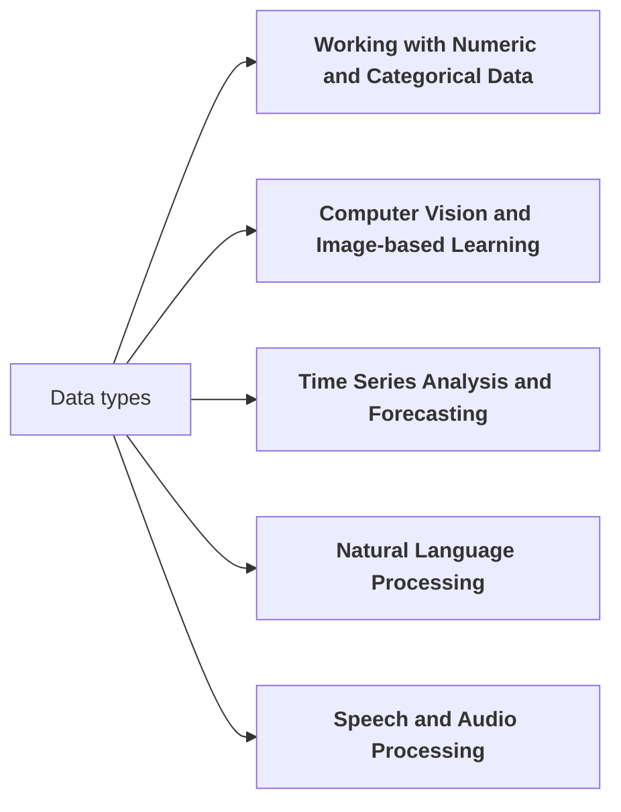

## Data Science Learning Path

We present 12 topics in the data science learning path, providing learning objectives, related skills, subtopics, and references/resources for each. The goal is to give graduate students a structured and comprehensive program to acquire data science expertise, including hands-on experience with real-world open-source tools and libraries.

### A: General Data Science

#### 1. Introduction to Data Science and Machine Learning

??? note "Topic description"

    **Learning Objective**: Understand the fundamental concepts of data science and machine learning, and their real-world applications.

    **Related Skills**:

    - Defining and framing data science problems
    - Identifying appropriate machine learning techniques for different tasks
    - Distinguishing between supervised and unsupervised learning

    **Subtopics**:

    - Definition and scope of data science: [Lies, Damned Lies, and Data Science](https://beabytes.com/data-science-lies/). Béatrice Moissinac.
    - Overview of machine learning algorithms (regression, classification, clustering): [Introduction to  Machine Learning](https://developers.google.com/machine-learning/intro-to-ml). Developers Google.
    - Applications of data science in various industries (e.g., healthcare, finance, marketing): [Data Science Applications Across 10 Different Industries](https://csweb.rice.edu/academics/graduate-programs/online-mds/blog/data-science-industry-applications). Rice University.
    - Ethical considerations in data science: [A Guide for Ethical Data Science](https://rss.org.uk/RSS/media/News-and-publications/Publications/Reports%20and%20guides/A-Guide-for-Ethical-Data-Science-Final-Oct-2019.pdf). Royal Statistical Society.
    - Hands-on introduction to machine learning using Python and scikit-learn: [Machine Learning Crash Course](https://developers.google.com/machine-learning/crash-course). Google Developers. 

    **References and Resources**:

    - [Data Science; Concepts and Practice](https://asolanki.co.in/wp-content/uploads/2019/04/Data-Science-Concepts-and-Practice-2nd-Edition-3.pdf). V. Kotu and B. Deshpande. 
    - [Data Science for Beginners - A curriculum](https://github.com/microsoft/Data-Science-For-Beginners/blob/main/README.md). Microsoft 10-week, 20-lesson curriculum all about Data Science. 
    - [General Data Science Learning Resources](https://github.com/ua-data7/LearningResources/wiki/General-Data-Science) 

####  2. Python for Data Science

??? note "Topic description"

    **Learning Objective**: Develop proficiency in using Python for data manipulation, analysis, and visualization.

    **Related Skills**:

    - Mastering Python syntax and data structures
    - Utilizing NumPy for efficient numerical operations
    - Applying Pandas for data ingestion, cleaning, and transformation

    **Subtopics**:

    - Python programming basics (variables, data types, control structures, functions)
    - NumPy arrays and universal functions
    - Pandas DataFrames and Series for data manipulation
    - Data visualization with Matplotlib and Seaborn
    - Integrating Python with data science libraries (scikit-learn, TensorFlow, PyTorch)

    **References and Resources**:

    - "Python for Data Analysis" by Wes McKinney
    - "Python Data Science Handbook" by Jake VanderPlas
    - Datacamp's Python for Data Science Track

#### 3. Ethical Considerations in Data Science

??? note "Topic description"

    **Learning Objective**: Develop an understanding of the ethical implications and responsible practices in data science.

    **Related Skills**:

    - Identifying and mitigating bias in data and models
    - Ensuring fair and equitable decision-making
    - Protecting privacy and data security

    **Subtopics**:
   
    - Bias and fairness in machine learning
    - Interpretability and explainability of models
    - Privacy-preserving techniques (differential privacy, federated learning)
    - Data provenance and provenance tracking
    - Responsible AI principles and guidelines

    **References and Resources**:

    - "Ethical Algorithms" by Michael Kearns and Aaron Roth
    - "Artificial Intelligence: A Modern Approach" by Stuart Russell and Peter Norvig
    - Coursera course "AI Ethics" by DeepLearning.AI

### B: Statistics

#### 4. Statistical Learning and Regression Models

??? note "Topic description"

    **Learning Objective**: Understand and apply statistical learning techniques, with a focus on regression models.
    
    **Related Skills**:

    - Fitting and evaluating linear regression models
    - Applying logistic regression for classification tasks
    - Interpreting model coefficients and making predictions

    **Subtopics**:
    
    - Simple and multiple linear regression
    - Assumptions and diagnostics of linear regression
    - Logistic regression for binary classification
    - Evaluating model performance (R-squared, accuracy, precision, recall, F1-score)
    - Regularization techniques (Ridge, Lasso, Elastic Net)

    **References and Resources**:

    - "An Introduction to Statistical Learning" by Gareth James et al.
    - "Pattern Recognition and Machine Learning" by Christopher Bishop
    - Coursera course "Machine Learning" by Andrew Ng

### C: Classical Machine Learning

#### 5. Classification Algorithms

??? note "Topic description"

    **Learning Objective**: Acquire knowledge of various classification algorithms and their application in real-world problems.

    **Related Skills**:
    
    - Implementing and evaluating decision tree classifiers
    - Applying k-nearest neighbors for classification
    - Understanding the principles of support vector machines

    **Subtopics**:

    - Decision tree classification
    - K-nearest neighbors (KNN) algorithm
    - Support vector machines (SVMs)
    - Evaluating classification models (accuracy, precision, recall, F1-score, ROC-AUC)
    - Handling class imbalance (oversampling, undersampling, SMOTE)

    **References and Resources**:

    - "Pattern Recognition and Machine Learning" by Christopher Bishop
    - "Hands-On Machine Learning with Scikit-Learn and TensorFlow" by Aurélien Géron
    - Udacity course "Intro to Machine Learning"

#### 6. Ensemble Methods

??? note "Topic description"

    **Learning Objective**: Explore ensemble techniques for improving the performance of machine learning models.
    
    **Related Skills**:
    
    - Implementing random forest algorithms
    - Understanding the principles of gradient boosting
    - Applying bagging and boosting techniques to enhance model accuracy

    **Subtopics**:
    
    - Random forest classification and regression
    - Gradient boosting with XGBoost and LightGBM
    - Bagging and boosting (AdaBoost, Gradient Boosting)
    - Hyperparameter tuning for ensemble methods
    - Feature importance and interpretation in ensemble models

    **References and Resources**:

    - "Hands-On Machine Learning with Scikit-Learn and TensorFlow" by Aurélien Géron
    - "Introduction to Statistical Learning" by Gareth James et al.
    - Kaggle micro-course on "Advanced Ensembling"

#### 7. Unsupervised Learning

??? note "Topic description"

    **Learning Objective**: Gain proficiency in unsupervised learning techniques for data exploration and pattern discovery.

    **Related Skills**:
    
    - Implementing K-means clustering algorithms
    - Applying principal component analysis (PCA) for dimensionality reduction
    - Identifying anomalies and outliers in data

    **Subtopics**:

    - K-means clustering
    - Hierarchical clustering
    - Principal component analysis (PCA)
    - Anomaly detection techniques (Isolation Forest, One-Class SVM)
    - Dimensionality reduction methods (t-SNE, UMAP)

    **References and Resources**:

    - "Pattern Recognition and Machine Learning" by Christopher Bishop
    - "Hands-On Unsupervised Learning Using Python" by Ankur Patel
    - Coursera course "Cluster Analysis in Data Mining" by University of Illinois

### D: Deep Learning

#### 8. Introduction to Deep Learning

??? note "Topic description"

    **Learning Objective**: Develop an understanding of the fundamental concepts and architectures of deep neural networks.
    
    **Related Skills**:
    
    - Constructing and training feedforward neural networks
    - Applying convolutional neural networks for image-related tasks
    - Selecting appropriate activation functions and optimization techniques

    **Subtopics**:

    - Artificial neural networks (ANNs) and their structure
    - Activation functions (sigmoid, ReLU, tanh)
    - Feedforward neural networks and their training
    - Convolutional neural networks (CNNs) for image recognition
    - Hyperparameter tuning and optimization techniques

    **References and Resources**:

    - "Deep Learning" by Ian Goodfellow, Yoshua Bengio, and Aaron Courville
    - "Deep Learning with Python" by François Chollet
    - Coursera course "Deep Learning Specialization" by deeplearning.ai

#### 9. Recurrent Neural Networks and Sequence Models

??? note "Topic description"

    **Learning Objective**: Understand the principles of recurrent neural networks and their applications in sequence-to-sequence problems.

    **Related Skills**:

    - Implementing LSTM and GRU models for sequence modeling
    - Applying recurrent neural networks for time series forecasting
    - Generating text and other sequential data using RNNs

    **Subtopics**:
    
    - Recurrent neural networks (RNNs)
    - Long short-term memory (LSTMs)
    - Gated recurrent units (GRUs)
    - Sequence-to-sequence modeling
    - Time series forecasting with RNNs

    **References and Resources**:

    - "Deep Learning for Time Series Forecasting" by Jason Brownlee
    - "Natural Language Processing with Python" by Steven Bird et al.
    - Coursera course "Sequence Models" by deeplearning.ai

#### 10. Generative Models

??? note "Topic description"

    **Learning Objective**: Explore generative models and their applications in synthesizing new data.
    
    **Related Skills**:
    
    - Implementing generative adversarial networks (GANs)
    - Applying variational autoencoders (VAEs) for image and text generation
    - Evaluating the performance of generative models

    **Subtopics**:
    
    - Generative adversarial networks (GANs)
    - Variational autoencoders (VAEs)
    - Generative modeling for images, text, and other data types
    - Evaluating generative models (Inception Score, FID, BLEU)
    - Applications of generative models (data augmentation, creative generation)

    **References and Resources**:
    
    - "Generative Adversarial Networks" by Ian Goodfellow et al.
    - "Variational Autoencoders" by Diederik Kingma and Max Welling
    - Deeplearning.ai course "Generative Adversarial Networks (GANs)"

#### 11. Transfer Learning and Fine-tuning

??? note "Topic description"

    **Learning Objective**: Understand the principles of transfer learning and how to leverage pre-trained models for various tasks.

    **Related Skills**:
    
    - Applying feature extraction with pre-trained models
    - Finetuning pre-trained models for domain-specific tasks
    - Evaluating the performance of transfer learning approaches

    **Subtopics**:
    
    - Concept of transfer learning
    - Feature extraction using pre-trained models (e.g., VGG, ResNet, BERT)
    - Finetuning pre-trained models for specific applications
    - Domain adaptation and dataset shift
    - Evaluating transfer learning performance

    **References and Resources**:

    - "Transfer Learning with Deep Learning" by Sebastian Ruder
    - "Practical Deep Learning for Cloud, Mobile, and Edge" by Anirudh Koul et al.
    - Coursera course "Convolutional Neural Networks" by deeplearning.ai

### E: Continuous Integration / Continuous Deployment 

#### 12. Model Deployment and Productionization

??? note "Topic description"

    **Learning Objective**: Gain knowledge on how to deploy and maintain machine learning models in production environments.

    **Related Skills**:
    
    - Containerizing models using Docker
    - Deploying models on cloud platforms (e.g., AWS, GCP, Azure)
    - Monitoring and maintaining production models

    **Subtopics**:
    
    - Containerization with Docker
    - Cloud deployment on AWS, GCP, and Azure
    - Serving models with Flask, FastAPI, or Streamlit
    - Model monitoring and logging
    - Continuous integration and deployment (CI/CD) pipelines

    **References and Resources**:
    
    - "Deploying Machine Learning Models" by Abhishek Thakur
    - "Kubernetes in Action" by Marko Lukša
    - Coursera course "Machine Learning Engineering for Production (MLOps)" by deeplearning.ai

***

## Working with different data types.

Next you will find five specialized data science learning paths that branch off from the core topics in the previous section. Each specialized path includes a learning objective, related skills, subtopics, and references/resources.

