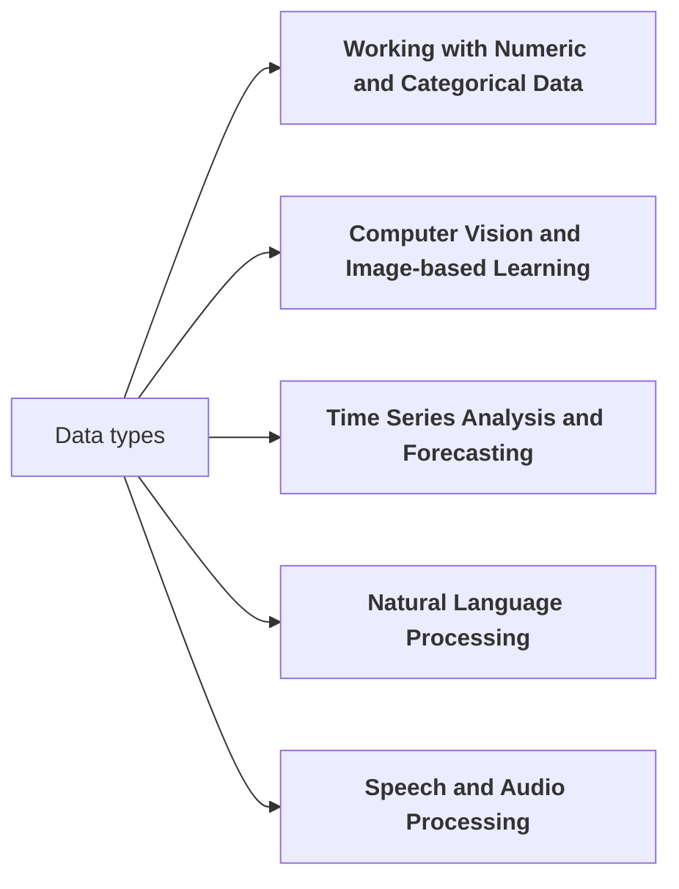

## Data Science Learning Path

We present 12 topics in the data science learning path, providing learning objectives, related skills, subtopics, and references/resources for each. The goal is to give graduate students a structured and comprehensive program to acquire data science expertise, including hands-on experience with real-world open-source tools and libraries.

### A: General Data Science

#### 1. Introduction to Data Science and Machine Learning

??? note "Topic description"

    **Learning Objective**: Understand the fundamental concepts of data science and machine learning, and their real-world applications.

    **Related Skills**:

    - Defining and framing data science problems
    - Identifying appropriate machine learning techniques for different tasks
    - Distinguishing between supervised and unsupervised learning

    **Subtopics**:

    - Definition and scope of data science
    - Overview of machine learning algorithms (regression, classification, clustering)
    - Applications of data science in various industries (e.g., healthcare, finance, marketing)
    - Ethical considerations in data science
    - Hands-on introduction to machine learning using Python and scikit-learn

    **References and Resources**:

    - "An Introduction to Statistical Learning" by Gareth James et al.
    - "Machine Learning for Absolute Beginners" by Oliver Theobald
    - Kaggle Learn courses on data science and machine learning fundamentals

####  2. Python for Data Science

??? note "Topic description"

    **Learning Objective**: Develop proficiency in using Python for data manipulation, analysis, and visualization.

    **Related Skills**:

    - Mastering Python syntax and data structures
    - Utilizing NumPy for efficient numerical operations
    - Applying Pandas for data ingestion, cleaning, and transformation

    **Subtopics**:

    - Python programming basics (variables, data types, control structures, functions)
    - NumPy arrays and universal functions
    - Pandas DataFrames and Series for data manipulation
    - Data visualization with Matplotlib and Seaborn
    - Integrating Python with data science libraries (scikit-learn, TensorFlow, PyTorch)

    **References and Resources**:

    - "Python for Data Analysis" by Wes McKinney
    - "Python Data Science Handbook" by Jake VanderPlas
    - Datacamp's Python for Data Science Track

#### 3. Ethical Considerations in Data Science

??? note "Topic decription"

    **Learning Objective**: Develop an understanding of the ethical implications and responsible practices in data science.

    **Related Skills**:

    - Identifying and mitigating bias in data and models
    - Ensuring fair and equitable decision-making
    - Protecting privacy and data security

   **Subtopics**:
   
   - Bias and fairness in machine learning
   - Interpretability and explainability of models
   - Privacy-preserving techniques (differential privacy, federated learning)
   - Data provenance and provenance tracking
   - Responsible AI principles and guidelines

   **References and Resources**:
   - "Ethical Algorithms" by Michael Kearns and Aaron Roth
   - "Artificial Intelligence: A Modern Approach" by Stuart Russell and Peter Norvig
   - Coursera course "AI Ethics" by DeepLearning.AI

### B: Statistics

#### 4. Statistical Learning and Regression Models

??? note "Topic description"

    **Learning Objective**: Understand and apply statistical learning techniques, with a focus on regression models.
    
    **Related Skills**:

    - Fitting and evaluating linear regression models
    - Applying logistic regression for classification tasks
    - Interpreting model coefficients and making predictions

    **Subtopics**:
    
    - Simple and multiple linear regression
    - Assumptions and diagnostics of linear regression
    - Logistic regression for binary classification
    - Evaluating model performance (R-squared, accuracy, precision, recall, F1-score)
    - Regularization techniques (Ridge, Lasso, Elastic Net)

    **References and Resources**:

    - "An Introduction to Statistical Learning" by Gareth James et al.
    - "Pattern Recognition and Machine Learning" by Christopher Bishop
    - Coursera course "Machine Learning" by Andrew Ng

### C: Classical Machine Learning

#### 5. Classification Algorithms

??? note "Topic description"

    **Learning Objective**: Acquire knowledge of various classification algorithms and their application in real-world problems.

    **Related Skills**:
    
    - Implementing and evaluating decision tree classifiers
    - Applying k-nearest neighbors for classification
    - Understanding the principles of support vector machines

    **Subtopics**:

    - Decision tree classification
    - K-nearest neighbors (KNN) algorithm
    - Support vector machines (SVMs)
    - Evaluating classification models (accuracy, precision, recall, F1-score, ROC-AUC)
    - Handling class imbalance (oversampling, undersampling, SMOTE)

    **References and Resources**:

    - "Pattern Recognition and Machine Learning" by Christopher Bishop
    - "Hands-On Machine Learning with Scikit-Learn and TensorFlow" by Aurélien Géron
    - Udacity course "Intro to Machine Learning"

#### 6. Ensemble Methods

??? note "Topic description"

    **Learning Objective**: Explore ensemble techniques for improving the performance of machine learning models.
    
    **Related Skills**:
    
    - Implementing random forest algorithms
    - Understanding the principles of gradient boosting
    - Applying bagging and boosting techniques to enhance model accuracy

    **Subtopics**:
    
    - Random forest classification and regression
    - Gradient boosting with XGBoost and LightGBM
    - Bagging and boosting (AdaBoost, Gradient Boosting)
    - Hyperparameter tuning for ensemble methods
    - Feature importance and interpretation in ensemble models

    **References and Resources**:

    - "Hands-On Machine Learning with Scikit-Learn and TensorFlow" by Aurélien Géron
    - "Introduction to Statistical Learning" by Gareth James et al.
    - Kaggle micro-course on "Advanced Ensembling"

#### 7. Unsupervised Learning

??? note "Topic description"

    **Learning Objective**: Gain proficiency in unsupervised learning techniques for data exploration and pattern discovery.

    **Related Skills**:
    
    - Implementing K-means clustering algorithms
    - Applying principal component analysis (PCA) for dimensionality reduction
    - Identifying anomalies and outliers in data

    **Subtopics**:

    - K-means clustering
    - Hierarchical clustering
    - Principal component analysis (PCA)
    - Anomaly detection techniques (Isolation Forest, One-Class SVM)
    - Dimensionality reduction methods (t-SNE, UMAP)

    **References and Resources**:

    - "Pattern Recognition and Machine Learning" by Christopher Bishop
    - "Hands-On Unsupervised Learning Using Python" by Ankur Patel
    - Coursera course "Cluster Analysis in Data Mining" by University of Illinois

### D: Deep Learning

#### 8. Introduction to Deep Learning

#### 9. Recurrent Neural Networks and Sequence Models

#### 10. Generative Models

#### 11. Transfer Learning and Fine-tuning

### E: Continuous Development / Continuous Integration 

#### 12. Model Deployment and Productionization

***

## Working with different data types.

Next you will find five specialized data science learning paths that branch off from the core topics in the previous section. Each specialized path includes a learning objective, related skills, subtopics, and references/resources.

