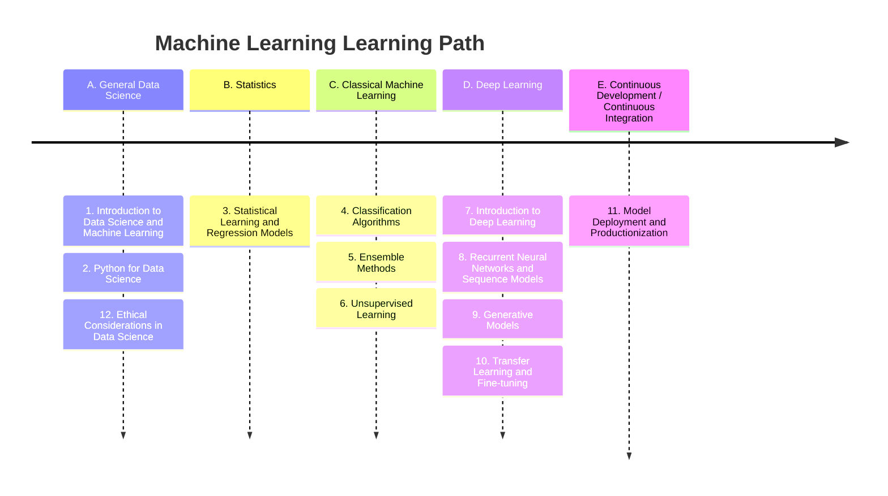
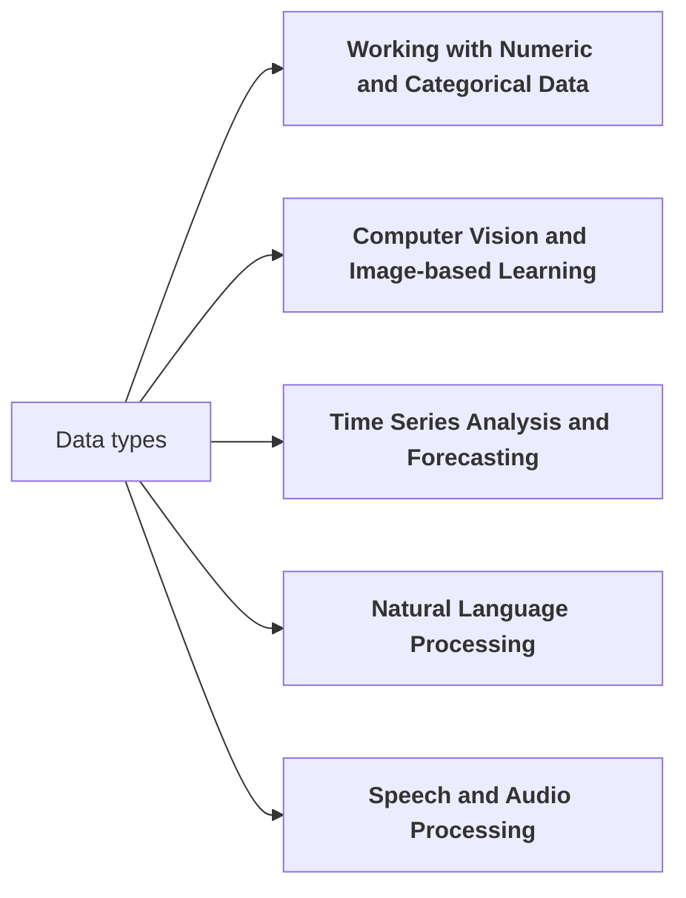

## Data Science Learning Path

We present 12 topics in the data science learning path, providing learning objectives, related skills, subtopics, and references/resources for each. The goal is to give graduate students a structured and comprehensive program to acquire data science expertise, including hands-on experience with real-world open-source tools and libraries.

A: General Data Science
   - Introduction to Data Science and Machine Learning
   - Python for Data Science
   - Ethical Considerations in Data Science

B: Statistics
   -  Statistical Learning and Regression Models

C: Classical Machine Learning
   -  Classification Algorithms
   - Ensemble Methods
   -  Unsupervised Learning

D: Deep Learning
   - Introduction to Deep Learning
   - Recurrent Neural Networks and Sequence Models
   - Generative Models
   - Transfer Learning and Fine-tuning

E: Continuous Development / Continuous Integration 

   - Model Deployment and Productionization

## Working with different data types.

Next you will find five specialized data science learning paths that branch off from the core topics in the previous section. Each specialized path includes a learning objective, related skills, subtopics, and references/resources.

