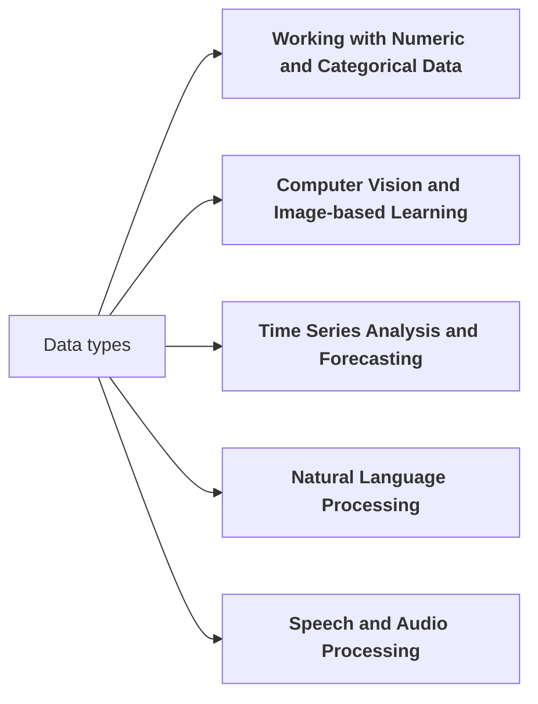

## Data Science Learning Path

We present 12 topics in the data science learning path, providing learning objectives, related skills, subtopics, and references/resources for each. The goal is to give graduate students a structured and comprehensive program to acquire data science expertise, including hands-on experience with real-world open-source tools and libraries.

### A: General Data Science

#### Introduction to Data Science and Machine Learning

  
Content

    **Learning Objective**: Understand the fundamental concepts of data science and machine learning, and their real-world applications.

    **Related Skills**:
  	 	1. Defining and framing data science problems
 		2. Identifying appropriate machine learning techniques for different tasks
 		3. Distinguishing between supervised and unsupervised learning
    **Subtopics**:
      	 	1. Definition and scope of data science
 		2. Overview of machine learning algorithms (regression, classification, clustering)
 		3. Applications of data science in various industries (e.g., healthcare, finance, marketing)
 		4. Ethical considerations in data science
 		5. Hands-on introduction to machine learning using Python and scikit-learn
    **References and Resources**:
 	  - "An Introduction to Statistical Learning" by Gareth James et al.
 	  - "Machine Learning for Absolute Beginners" by Oliver Theobald
 	  - Kaggle Learn courses on data science and machine learning fundamentals

####  Python for Data Science

#### Ethical Considerations in Data Science

### B: Statistics
   - Statistical Learning and Regression Models

### C: Classical Machine Learning
   - Classification Algorithms
   - Ensemble Methods
   - Unsupervised Learning

### D: Deep Learning
   - Introduction to Deep Learning
   - Recurrent Neural Networks and Sequence Models
   - Generative Models
   - Transfer Learning and Fine-tuning

### E: Continuous Development / Continuous Integration 
   - Model Deployment and Productionization

***

## Working with different data types.

Next you will find five specialized data science learning paths that branch off from the core topics in the previous section. Each specialized path includes a learning objective, related skills, subtopics, and references/resources.

