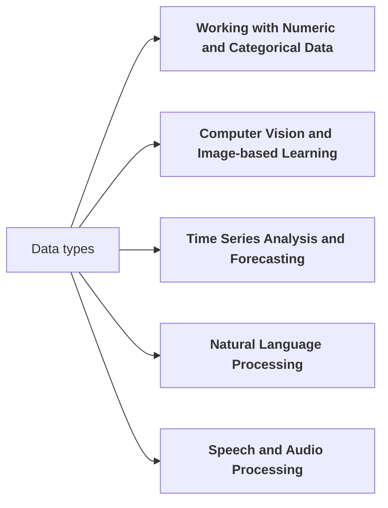

## Working with different data types.

```mermaid
  flowchart LR;
      A@{shape:processes, label: "Data types"}-->B["`**Working with Numeric and Categorical Data**`"];
      A-->C["`**Computer Vision and Image-based Learning**`"];
      A-->D["`**Time Series Analysis and Forecasting**`"];
      A-->E["`**Natural Language Processing**`"];
      A-->F["`**Speech and Audio Processing**`"];
      click B href "https://github.com/ua-datalab/mlpaths/wiki/Working-with-Numeric-and-Categorical-Data" "Open this in a new tab" _blank
      click C href "https://github.com/ua-datalab/mlpaths/wiki/Computer-Vision-and-Image%E2%80%90based-Learning" "Open this in a new tab" _blank
      click D href "https://github.com/ua-datalab/mlpaths/wiki/Time-Series-Analysis-and-Forecasting" "Open this in a new tab" _blank
      click E href "https://github.com/ua-datalab/mlpaths/wiki/Natural-Language-Processing" "Open this in a new tab" _blank
      click F href "https://github.com/ua-datalab/mlpaths/wiki/Computer-Vision-and-Image%E2%80%90based-Learning" "Open this in a new tab" _blank


```

