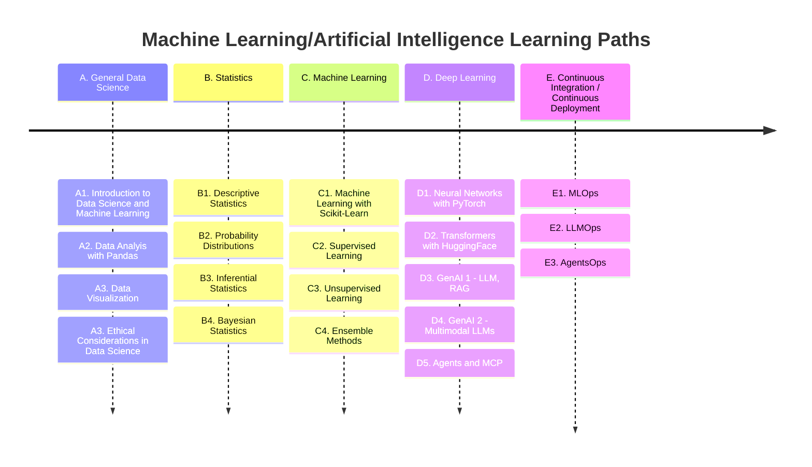

# Take the LEAD with Datalab.

## The Datalab _LEAD Program: Learn, Experience, Advance, Develop_.

### Data Science ML/AI Learning Paths

We present 12 topics in the data science learning path, providing learning objectives, related skills, subtopics, and references/resources for each. The goal is to give graduate students a structured and comprehensive program to acquire data science expertise, including hands-on experience with real-world open-source tools and libraries.

:construction: :construction: :construction: :construction: 

#### A. General Data Science

<!--
[**A1: Introduction to Data Science and Machine Learning**](mlpaths/A1_Intro_to_DataScience_and_ML.md)
-->

-   [**A1. Introduction to Data Science and Machine Learning**](mlpaths/A1_Intro_to_DataScience_and_ML.md)

    ---

    
Data Science is an interdisciplinary field focused on extracting knowledge and insights from data. Machine Learning (ML), a key component of Artificial Intelligence (AI), enables systems to learn from data to make decisions or predictions.

-   [<b>A2. Data Analysis with Pandas</b>](mlpaths/A2_Python_for_DataScience.md)

    ---

    
Pandas is a powerful and popular open-source Python library used for data analysis and manipulation.

-   [<b>A3. Data Visualization with Matplotlib and Seaborn</b>](mlpaths/A2_Python_for_DataScience.md)

    ---

    
Matplotlib is a library in Python that enables users to generate visualizations like histograms, scatter plots, bar charts, pie charts and much more. Seaborn is a visualization library that is built on top of Matplotlib. It provides data visualizations that are typically more aesthetic and statistically sophisticated.
 

-   <b>A4. Ethical Considerations of Data Science</b>

    ---

    
Ethics in data science encompasses the moral principles and guidelines that govern the collection, analysis, and use of data to ensure responsible and beneficial outcomes. 

#### B. Statistics

-   <b>B1. Descriptive Statistics</b>

    ---

    
Descriptive Statistics is a set of brief descriptive coefficients that summarize a given data set representative of an entire or sample population.

-   <b>B2. Probability Distributions</b>

    ---

    
In probability theory and statistics, a probability distribution is a function that gives the probabilities of occurrence of possible events for an experiment.

-   <b>B3. Inferential Statistics</b>

    ---

    
Inferential statistical analysis infers properties of a population, for example by testing hypotheses and deriving estimates.

-   <b>B4. Bayesian Statistics</b>

    ---

    
Bayesian statistics is a method of statistical inference that uses Bayes' Theorem to update the probability of a hypothesis as new evidence becomes available. 

#### C. Machine Learning

-   <b>C1. Machine Learning with Scikit-Learn</b>

    ---

    
Scikit-learn is a powerful and widely used Python library for machine learning. 

-   <b>C2. Unsupervised Learning</b>

    ---

    
Unsupervised learning is a type of machine learning where algorithms learn from unlabeled data, identifying patterns and structures without specific guidance or desired outputs.

-   <b>C3. Supervised Learning</b>

    ---

    
Supervised learning is a type of machine learning where an algorithm learns to predict an output variable by being trained on a labeled dataset. 

-   <b>C4. Ensemble Learning</b>

    ---

    
Ensemble learning in machine learning combines multiple individual models (base learners) to create a more accurate and robust predictive model than any single model alone. 

#### D. Deep Learning

-   <b>D1. Deep Learning in PyTorch </b>

    ---

    
PyTorch is an open-source machine learning framework, primarily used for deep learning applications.

-   <b>D2. Transformers with HuggingFace</b>

    ---

    
Hugging Face Transformers is a Python library and open-source framework used to access and utilize pre-trained machine learning models for tasks like natural language processing (NLP), computer vision, audio processing, and multi-modal applications. 

-   <b>D3. Generative AI 1 - LLM, RAG</b>

    ---

    
Retrieval-augmented generation (RAG) is a technique that enables large language models (LLMs) to retrieve and incorporate new information. 

-   <b>D4. Generative AI - Multimodal LLMs </b>

    ---

    
Multimodal LLMs, are advanced AI systems that can process and generate content across multiple types of data, or modalities, such as text, images, audio, and video. 

#### E. Continuous Integration / Continuous Development

-   <b>D1. MLOps</b>

    ---

    
MLOps (Machine Learning Operations), MLOps is a way to manage machine learning models, making it easier to develop, deploy, and update them as business needs change.

-   <b>D2. LLMOps</b>

    ---

    
 LLMOps (Large Language Model Operations), builds on MLOps practices but addresses the unique challenges of deploying large language models, such as GPT, BERT, and LLaMA. These models require substantial computational resources, prompt engineering, and ongoing monitoring to manage performance, ethics, and latency.

-   <b>D3. AgentOps</b>

    ---

    
AgentOps enables the deployment of autonomous agents that perform complex tasks with minimal human intervention. These agents integrate with APIs, make decisions based on real-time data, and adapt to changing conditions, making them ideal for high-stakes applications requiring autonomy.

***

Created: 05/25/2025 (C. Lizárraga); Updated: 05/29/2025 (C. Lizárraga)

 2025. [University of Arizona DataLab](https://datascience.arizona.edu/education/uarizona-data-lab), [Data Science Institute](https://datascience.arizona.edu/

