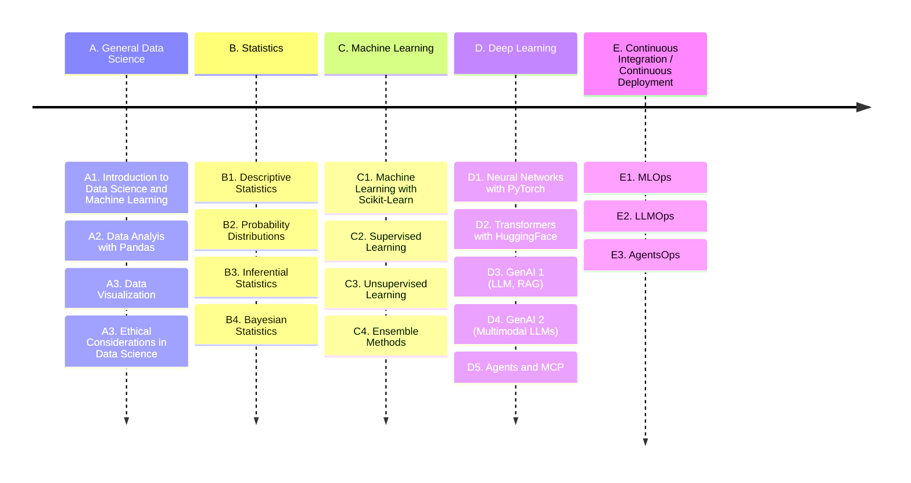

# Take the LEAD with Datalab.

## The Datalab _LEAD Program: Learn, Experience, Advance, Develop_.

### :material-cast-education: Machine Learning/Artificial Intelligence Learning Paths

We present 20 topics in the data science learning path, providing learning objectives, related skills, subtopics, and references/resources for each. The goal is to give graduate students a structured and comprehensive program to acquire data science expertise, including hands-on experience with real-world open-source tools and libraries.

:construction: :construction: :construction: :construction: 

#### :material-book-open: A. General Data Science

<!--
[**A1: Introduction to Data Science and Machine Learning**](mlpaths/A1_Intro_to_DataScience_and_ML.md)
-->

-   [<b> :material-creation: A1. Introduction to Data Science and Machine Learning</b>](mlpaths/A1_Intro_to_DataScience_and_ML.md)

    ---

    
Data Science is an interdisciplinary field focused on extracting knowledge and insights from data. Machine Learning (ML), a key component of Artificial Intelligence (AI), enables systems to learn from data to make decisions or predictions.

-   [<b> :material-poll: A2. Data Analysis with Pandas</b>](mlpaths/A2_Python_for_DataScience.md)

    ---

    
Pandas is an open-source Python library used for data manipulation and analysis. It provides data structures, such as Series (1D) and DataFrames (2D), designed to handle tabular datasets efficiently. 

-   [<b> :material-chart-scatter-plot-hexbin: A3. Data Visualization with Matplotlib and Seaborn</b>](mlpaths/A2_Python_for_DataScience.md)

    ---

    
Matplotlib is a library in Python that enables users to generate visualizations like histograms, scatter plots, bar charts, pie charts and much more. Seaborn is a visualization library that is built on top of Matplotlib. It provides data visualizations that are typically more aesthetic and statistically sophisticated.
 

-   <b> :material-scale-balance: A4. Ethical Considerations of Data Science</b>

    ---

    
Ethics in data science encompasses the moral principles and guidelines that govern the collection, analysis, and use of data to ensure responsible and beneficial outcomes. 

####  :material-book-open: B. Statistics

-   <b> :material-poll: B1. Descriptive Statistics</b>

    ---

    
Descriptive Statistics is a set of brief descriptive coefficients that summarize a given data set representative of an entire or sample population.

-   <b> :material-dice-6-outline: B2. Probability Distributions</b>

    ---

    
In probability theory and statistics, a probability distribution is a function that gives the probabilities of occurrence of possible events for an experiment.

-   <b> :material-ab-testing: B3. Inferential Statistics</b>

    ---

    
Inferential statistical analysis infers properties of a population, for example by testing hypotheses and deriving estimates.

-   <b> :material-update: B4. Bayesian Statistics</b>

    ---

    
Bayesian statistics is a method of statistical inference that uses Bayes' Theorem to update the probability of a hypothesis as new evidence becomes available. 

####  :material-book-open: C. Machine Learning

-   <b> :material-chart-line: C1. Machine Learning with Scikit-Learn</b>

    ---

    
Scikit-learn is a powerful and widely used Python library for machine learning. 

-   <b> :material-view-dashboard: C2. Unsupervised Learning</b>

    ---

    
Unsupervised learning is a type of machine learning where algorithms learn from unlabeled data, identifying patterns and structures without specific guidance or desired outputs.

-   <b> :material-human-male-board-poll: C3. Supervised Learning</b>

    ---

    
Supervised learning is a type of machine learning where an algorithm learns to predict an output variable by being trained on a labeled dataset. 

-   <b> :material-ballot: C4. Ensemble Learning</b>

    ---

    
Ensemble learning in machine learning combines multiple individual models (base learners) to create a more accurate and robust predictive model than any single model alone. 

####  :material-book-open: D. Deep Learning

-   <b>  :material-brain: D1. Deep Learning in PyTorch </b>

    ---

    
PyTorch is an open-source ML framework offering flexible deep learning development with Python integration. It features dynamic computation graphs and GPU acceleration for neural networks, computer vision, and NLP tasks.
    

-   <b> :material-robot: D2. Transformers with HuggingFace</b>

    ---

    
Hugging Face Transformers is a Python library and open-source framework used to access and utilize pre-trained machine learning models for tasks like natural language processing (NLP), computer vision, audio processing, and multi-modal applications. 

-   <b> :material-sitemap:  D3. Generative AI 1 - LLM, RAG</b>

    ---

    
Retrieval-augmented generation (RAG) is a technique that enables large language models (LLMs) to retrieve and incorporate new information. 

-   <b> :material-multimedia: D4. Generative AI - Multimodal LLMs </b>

    ---

    
Multimodal LLMs, are advanced AI systems that can process and generate content across multiple types of data, or modalities, such as text, images, audio, and video. 

####  :material-book-open: E. Continuous Integration / Continuous Development

-   <b> :material-developer-board: D1. MLOps</b>

    ---

    
MLOps (Machine Learning Operations), is a way to manage machine learning models, making it easier to develop, deploy, and update them as business needs change.

-   <b> :material-developer-board: D2. LLMOps</b>

    ---

    
 LLMOps (Large Language Model Operations), extends MLOps practices to handle large language model deployment challenges. It focuses on managing computational resources, prompt engineering, and monitoring model performance and ethics.

-   <b> :material-face-agent: D3. AgentOps</b>

    ---

    
AgentOps deploys autonomous agents that perform complex tasks independently. These agents work with APIs, use real-time data for decisions, and adapt dynamically - making them suitable for autonomous high-stakes applications.

:bookmark: [Prompt Engineering](PromptEng/prompteng.md)

***

Created: 05/25/2025 (C. Lizárraga); Updated: 05/29/2025 (C. Lizárraga)

:material-creative-commons:  2025. [University of Arizona DataLab](https://datascience.arizona.edu/education/uarizona-data-lab), [Data Science Institute](https://datascience.arizona.edu/)

