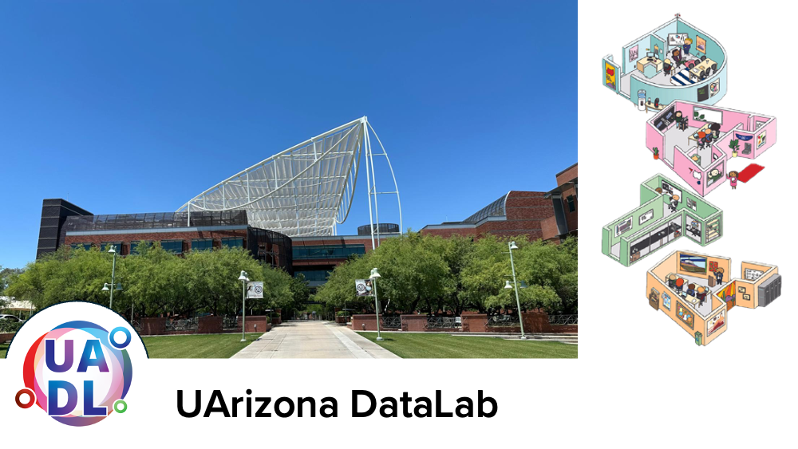

# Welcome to the UArizona DataLab Github!

{width=1200}

***

# Workshops

Our workshops focus on promoting Data Science Literacy among the university community. This ranges from satisfying curiosity to diverse topics in Statistics and Data Science to Machine Learning, to promote skill development in data modeling based on Machine Learning and Deep Learning algorithms across the wide science community of our University.

***

# 2024 Workshops

Are you interested in improving your professional skills in data analytics tools, methods, scientific analysis and statistics?

The [UArizona DataLab](https://www.datascience.arizona.edu/education/uarizona-data-lab) team invites you to attend our weekly Workshops. All sessions are conducted in hybrid mode. Please join us in-person at the Weaver Science & Engineering Library Room 212, or join via Zoom:[**864 2322 3879**](https://arizona.zoom.us/j/86423223879)

## Notes and code repositories  

* [Bioinformatics & Genomics](https://github.com/ua-datalab/Bioinformatics/wiki)
* [Classical Machine Learning](https://github.com/ua-datalab/MLWorkshops/wiki)
* [Craking the Coding Interview](https://github.com/ua-datalab/cracking_the_coding_interview)
* [Data Engineering Technologies](https://github.com/ua-datalab/DataEngineering)
* [Data Science Tapas](https://github.com/ua-datalab/DataScienceTapas/wiki)
* [Deep Learning](https://github.com/ua-datalab/DLWorkshops/wiki)
* [Graph Machine Learning](https://github.com/ua-datalab/GraphML)
* [Introduction to Data Science](https://github.com/ua-datalab/Workshops/wiki)
* [Generative AI](https://github.com/ua-datalab/Generative-AI/wiki)
* [Natural Language & Speech Technology](https://github.com/ua-datalab/NLP-Speech/wiki)
* [Neural Networks](https://github.com/ua-datalab/NeuralNetworks/wiki)
* [NextGen Geospatial Data Science](https://github.com/ua-datalab/Geospatial_Workshops/wiki)
* [Prompt Engineering & AI Application Deployment - GPT 101](https://ua-data7.github.io/introllms/)

***

## Other resources

* [Previous Data Science Institute Workshops](https://workshops-uad7.github.io/)
* [Data Science Learning Resources wiki](https://github.com/ua-data7/LearningResources/wiki)
* [DataLab Projects](https://github.com/clizarraga-UAD7/DataScienceLab/wiki/Data-Lab-Projects)

***

## UArizona DataLab Social 

* [Github](https://github.com/ua-datalab)
* [Linkedin](https://www.linkedin.com/company/100483432/admin/feed/posts/)
* [Twitter/X](https://twitter.com/UArizonaDataLab)
* [Facebook Page](https://www.facebook.com/profile.php?id=61556132138807)
* Workshop videorecordings [YouTube Channel](https://www.youtube.com/@UArizonaDataLab)
* Questions / Contact Us: UA Data Science Slack (uadatascience.slack.com) `#datalab-chatter`

***

Please visit the UArizona [**Data Science Institute Events Calendar**](https://www.datascience.arizona.edu/calendar) for more detailed information.

***

[UArizona DataLab](https://www.datascience.arizona.edu/education/uarizona-data-lab), is a strategic partnership between the [University of Arizona's](https://www.arizona.edu/):  [Data Science Institute](https://www.datascience.arizona.edu/), [CyVerse](https://cyverse.org/), and the
[Institute for Computation & Data-Enabled Insight](https://datainsight.arizona.edu/).

|  | Sponsor organizations | |
| :--: | :--: | :--: |
| [{width="600"}](https://datascience.arizona.edu) | [{width="300"}](https://cyverse.org/) | [{width="600"}](https://datainsight.arizona.edu/) |
